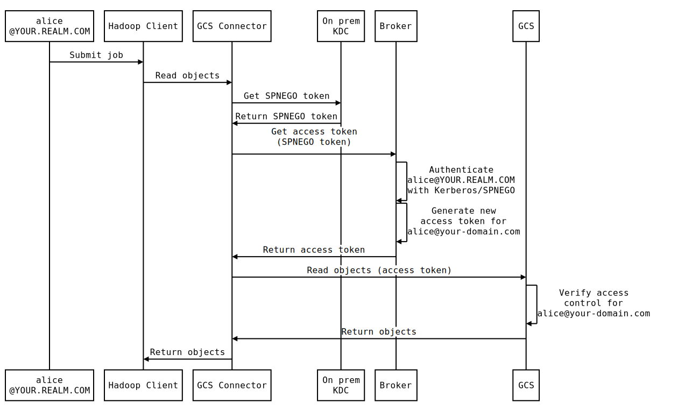
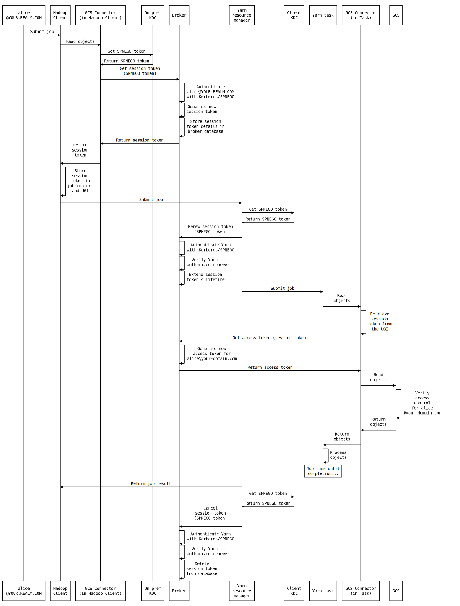

# Authentication

## Kerberos & SPNEGO

The broker service relies on Kerberos –more specifically [SPNEGO](https://en.wikipedia.org/wiki/SPNEGO) tokens– to
authenticate users.

A SPNEGO token is a Kerberos service ticket that contains the requester principal's username and that is
encrypted with the requested service principal's key. Only the service principal can decrypt that token to
reveal the encrypted username.

The broker service does not communicate directly with the KDC to decrypt SPNEGO tokens. Instead, it uses
[keytabs](https://web.mit.edu/kerberos/krb5-latest/doc/basic/keytab_def.html) to do the decryption offline.
You can use either one of the following two approaches to manage principals and keytabs for the broker service:

-   Create a `broker/<broker-hostname>` principal in each realm (for example `broker/<broker-hostname>@USER_REALM`
    in your users' realm and `broker/<broker-hostname>@HADOOP_CLUSTER` in your Hadoop cluster's realm).
    Then create a separate keytab for each one of the broker principals (i.e. one keytab per realm) and upload the
    keytabs to the broker service.
-   Create a single `broker/<broker-hostname>` principal in one of your realms — either a separate realm dedicated
    to the broker, or a realm that already hosts principals for other services. Then set up uni-directional cross-realm
    trust from your broker's realm to the realms that host the users who need to access the broker service.
    Then create a keytab for the broker principal and upload it to the broker service.

Once the broker service has the appropriate keytab(s), it is able to authenticate users.

When a client wants to call the broker service, the [GCS Connector](https://cloud.google.com/dataproc/docs/concepts/connectors/cloud-storage)
calls the KDC associated with the broker's realm. The KDC then creates a new SPNEGO token for the user and encrypts
it with the broker principal's key. Once the GCS Connector receives the new SPNEGO token, it sends the request to
the broker and passes the SPNEGO token via a request header.

When the broker receives the request, it uses its available keytab(s) to attempt to decrypt the provided SPNEGO token.
If the decryption succeeds, then the broker can retrieve the full username from the encrypted SPNEGO token and
trust that it is a legitimately authenticated user.

## Different modes of authentication

The broker enables different modes of authentication: direct authentication, delegated authentication, and
proxy-user impersonation.

### Direct authentication

With this mode of authentication, a user directly obtains an access token from the broker by authenticating with
Kerberos. The broker can authenticate the user by using a Kerberos keytab. This mode of authentication is used for
simple operations that don't need to be run over multiple distributed tasks, for example to list the contents of a
bucket:

```shell
hadoop fs -ls gs://[my-bucket]
```

The following diagram illustrates the overall architecture for direct authentication:


The following sequence diagram describes the workflow for direct authentication:



### Delegated authentication

Delegated authentication is performed in more complex use cases that involve running a job across multiple distributed
tasks. For example:

```shell
hadoop jar wordcount.jar wordcount gs://[input-bucket]/data.txt gs://[output-bucket]
```

The broker's delegated authentication mechanism plugs into Hadoop's delegation token system. This allows the broker
to be compatible with many tools in the Hadoop ecosystem like Yarn, Spark, or Hive.

The following diagram illustrates the overall architecture for delegated authentication:


The following sequence diagram describes the workflow for delegated authentication:



The renewal process is handled automatically by Yarn. Here is how it works:

1.  The client calls the new GCS Connector extension's [`FileSystem.getDelegationToken`](https://github.com/apache/hadoop/blob/601b5038954bd3b44c02e58a2fbaa15082d8b54d/hadoop-common-project/hadoop-common/src/main/java/org/apache/hadoop/fs/FileSystem.java#L485)
    method, which instantiates a [`TokenIdentifier`](https://github.com/apache/hadoop/blob/601b5038954bd3b44c02e58a2fbaa15082d8b54d/hadoop-common-project/hadoop-common/src/main/java/org/apache/hadoop/security/token/TokenIdentifier.java),
    which calls the broker to obtain a new session token (aka delegation token).
2.  The client passes the session token to the job application context. The session token is also
    securely stored in the [UserGroupInformation](https://hadoop.apache.org/docs/current/api/org/apache/hadoop/security/UserGroupInformation.html)
    `currentUser`'s credentials.
3.  The Yarn Resource Manager (YRM) calls the GCS Connector extension's [`TokenRenewer.renew`](https://github.com/apache/hadoop/blob/601b5038954bd3b44c02e58a2fbaa15082d8b54d/hadoop-common-project/hadoop-common/src/main/java/org/apache/hadoop/security/token/TokenRenewer.java#L57)
    method, which calls the broker to extend the session token's lifetime (configurable, defaults to 1 day).
    The YRM does this to verify that the "yarn" user is authorized to renew the session token and to catch
    potential issues early before submitting the job.
4.  The job is submitted and the tasks start running.
5.  When a task needs to access GCS, it calls the GCS Connector extension's [`AccessTokenProvider.refresh`](https://github.com/GoogleCloudPlatform/bigdata-interop/blob/61689bdd4e0dcdc3d2063952202f8f0fd7d39622/util-hadoop/src/main/java/com/google/cloud/hadoop/util/AccessTokenProvider.java#L53)
    method, which calls the broker to get a new access token, which is valid for 1 hour. The task then uses
    that access token to access GCS.
6.  When the access token expires (after 1 hour), the next request to GCS fails. The GCS Connector detects the
    failure, calls the broker again and trades the session token for a new access token, then retries the GCS
    request with the new access token. The task's work then resumes as normal.
7.  When a session token is at ~90% of its lifetime, the YRM calls the [`TokenRenewer.renew`](https://github.com/apache/hadoop/blob/601b5038954bd3b44c02e58a2fbaa15082d8b54d/hadoop-common-project/hadoop-common/src/main/java/org/apache/hadoop/security/token/TokenRenewer.java#L57)
    method again to extend the session token's lifetime by another renewal period. This ensures that the
    session token used by the tasks remains valid for the entire duration of the job.
8.  At the end of the job, the YRM calls the GCS Connector extension's [`TokenRenewer.cancel`](https://github.com/apache/hadoop/blob/601b5038954bd3b44c02e58a2fbaa15082d8b54d/hadoop-common-project/hadoop-common/src/main/java/org/apache/hadoop/security/token/TokenRenewer.java#L66)
    method, which calls the broker to cancel the session token. At that point, the session token
    is rendered unusable.

For more information, see the [sessions](sessions.md) documentation.

### Proxy user impersonation

Principals for applications like Hive, Oozie, or Presto are typically configured as [proxy users](https://hadoop.apache.org/docs/current/hadoop-project-dist/hadoop-common/Superusers.html)
(also sometimes referred to as "super users"). The proxy user privilege enables those services to impersonate other
Kerberos principals. This allows, for example, Hive to execute the `UserGroupInformation:doAs()` method to read files
from HDFS on behalf of the user who is running a Hive query.

When a Hive job is running, the GCS connector calls the broker and sends a SPNEGO token for the
[logged-in principal](https://hadoop.apache.org/docs/current/api/org/apache/hadoop/security/UserGroupInformation.html#getLoginUser())
(e.g. "hive") in the request authentication header and the [`currentUser`](https://hadoop.apache.org/docs/current/api/org/apache/hadoop/security/UserGroupInformation.html#getCurrentUser())'s
username (e.g. "alice") as a request parameter. The broker then checks that the SPNEGO token's Kerberos
principal is whitelisted in the [`proxy-users`](settings.md#proxy-users) setting, and if so, returns a GCP access token
for the "alice@your-domain.com" Cloud Identity.

The `proxy-users` setting is formatted as follows:

```
proxy-users = [
  { proxy = <String>, [users = [<String>, ...] | groups = [<String>, ...]]},
  ...
]
```

The `proxy` attribute designates the name of a proxy user. Optionally, to narrow down the scope of users that can be
impersonated by the given proxy user, you can provide either one of the following attributes:
 
*   `users`: List of GSuite users or service accounts.
*   `groups`: List of GSuite groups. To enable this feature, you must give the broker service account
    [domain-wide delegation authority](https://developers.google.com/admin-sdk/directory/v1/guides/delegation) for your
    GSuite domain with the `https://www.googleapis.com/auth/admin.directory.group.member.readonly` API scope, and set the
    [`gsuite-admin`](settings.md#gsuite-admin) setting to the name of a GSuite admin user. This is required so the
    broker service can call the [GSuite Directory API](https://developers.google.com/admin-sdk/directory) to verify group
    memberships for the impersonated users.

For example, the below sample configuration mandates that `hive/hive.your-domain.com@YOUR.REALM.COM` is allowed to
impersonate only `alice@your-domain.com` and `bob@your-domain.com`, and that `oozie/oozie.your-domain.com@YOUR.REALM.COM`
is allowed to impersonate all users who belong to the `datascience@your-domain.com` group:

```
proxy-users = [
  { proxy = "hive/hive.your-domain.com@YOUR.REALM.COM", users = ["alice@your-domain.com", "bob@your-domain.com"] },
  { proxy = "oozie/oozie.your-domain.com@YOUR.REALM.COM", groups = ["datascience@your-domain.com"] }
]
```
