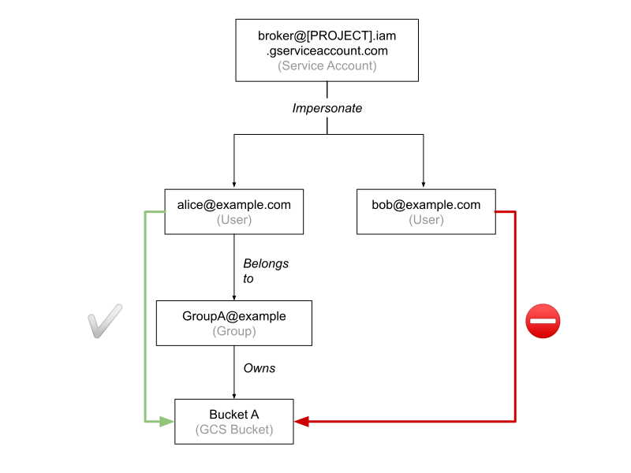
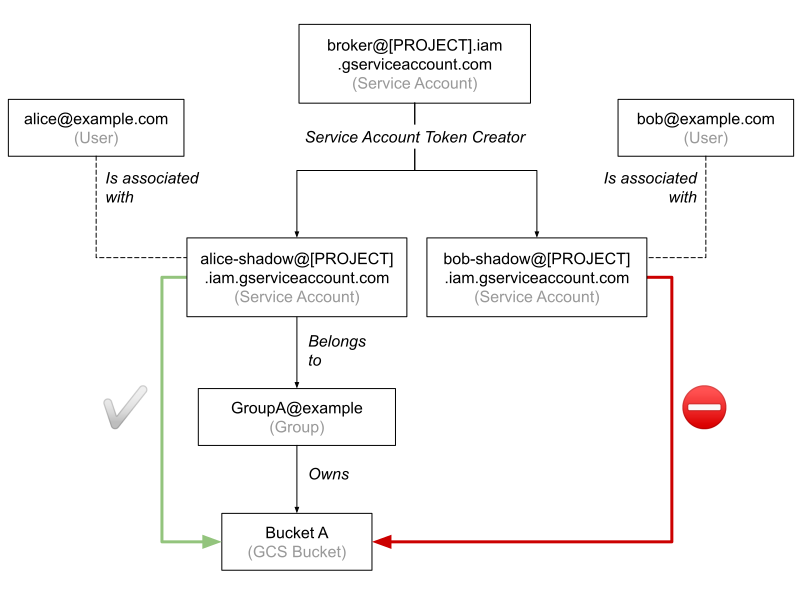
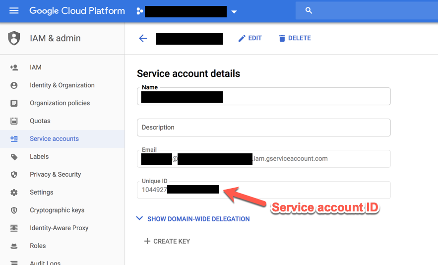
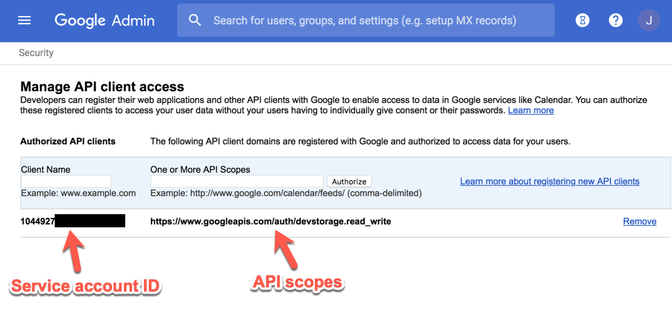

# Access token providers

The broker service can use different of providers to generate access tokens for a Google identity to access Google APIs.

## Available providers

You can specify which provider the broker should use by setting the [`provider.backend`](settings.md#providerbackend)
setting to the provider's class path.

All providers are included in the [broker server](broker-server.md) package. 

### Hybrid provider

_Class path:_ `com.google.cloud.broker.apps.brokerserver.accesstokens.providers.HybridProvider`

This is the default provider. This provider doesn't directly generate access tokens - instead, it delegates that task
to either:

-   the [`Service account provider`](#service-account-provider) if the given cloud identity's name ends with
    `.iam.gserviceaccount.com`.
-   the provider specified in the [`provider.hybrid.user-provider`](settings.md#providerhybriduser-provider) setting
    (which defaults to the [Refresh token Provider](#refresh-token-provider)'s class path) for all other identities.

This provider requires that you set the following setting(s): [`provider.hybrid.user-provider`](settings.md#providerhybriduser-provider).

### Refresh token provider

_Class path:_ `com.google.cloud.broker.apps.brokerserver.accesstokens.providers.RefreshTokenProvider`

A [refresh token](https://developers.google.com/identity/protocols/OAuth2WebServer#offline) is a token that can be used
to generate new access tokens for Google identities.

Refresh tokens are obtained by the [Authorizer app](authorizer.md), then stored in the broker's [database](database.md).
**Refresh tokens are long-lived credentials, so they must be stored securely. To reduce risk, consider [revoking](#revoking-refresh-tokens)
those tokens periodically.**

Below is the schema for the refresh token table:

-   `id`: Name of the Cloud Identity associated with the token.
-   `creation_time`: Time at which the refresh token was obtained by the broker.
-   `value`: [Encrypted](encryption.md) value of the OAuth refresh token.

Obtaining a refresh token is a one-time process for each user, although there are some cases where a refresh token can
expire (for more details, see [refresh token expiration](https://developers.google.com/identity/protocols/OAuth2#expiration)).

Once the broker has a refresh token for a user, it can use the `RefreshTokenProvider` to generate access tokens for that
user on demand as requested by the broker clients.

This provider offers tight scoping on a per-user basis. This allows to ensure that the broker may only generate access
tokens for a specific whitelist of Google users.

Let's take an example:

-   The user Alice belongs to Group A, which owns Bucket A. The user Bob doesn't belong to any group and doesn't have
    access to any buckets.
-   Alice and Bob use the Authorizer app to let the broker obtain refresh tokens.
-   The broker can now use the refresh tokens to obtain access tokens for both Bob and Alice. However, only access
    tokens obtained for Alice can be used to access Bucket A.



This provider requires that you set the following setting(s): [`oauth.client-secret-json-path`](settings.md#oauthclient-secret-json-path).

#### Revoking refresh tokens

Refresh tokens are long-lived credentials and are effective indefinitely unless they are explicitly revoked. To reduce
risks associated with storing these tokens for an extensive period of time, it is recommended to revoke and delete them
after they've reached a certain age (e.g. 24 hours or 7 days). To achieve this, you can periodically run (e.g. via a
cron job) the following command (Replace `[AGE]` with the maximum allowed age, in hours):

```shell
CONFIG_FILE=/<path>/application.conf java com.google.cloud.broker.apps.brokerserver.accesstokens.providers.RevokeRefreshTokens [AGE]
```

### Service account provider

_Class path:_ `com.google.cloud.broker.apps.brokerserver.accesstokens.providers.ServiceAccountProvider`

The shadow service accounts approach leverages a Cloud IAM feature called [short-lived service account credentials](https://cloud.google.com/iam/docs/creating-short-lived-service-account-credentials).
This feature allows a given service account to obtain access tokens on behalf of other service accounts.

This approach only works with service accounts, not users. This means that you need to create separate service accounts,
one for each human user. Those are called **shadow service accounts**.

Let's take an example:

-   The user Alice belongs to Group A, which owns Bucket A. The user Bob doesn't belong to any group and doesn't have
    access to any buckets.
-   You create a service account for Bob. You create another service account for Alice, and add Alice's service account
    to Group A.
-   You create a service account for the broker service and give it the [Service Account Token Creator](https://cloud.google.com/iam/docs/service-accounts#the_service_account_token_creator_role)
    role for Bob's and Alice's service accounts.
-   The broker's service account can now obtain access tokens for both Bob's and Alice's service accounts. However, only
    access tokens obtained for Alice's service account can be used to access Bucket A.



To use the `ServiceAccountProvider`, follow this procedure:

-   Create a separate shadow service account for each user that is expected to use Hadoop in GCP.
-   Create a service account for the broker.
-   Give the broker's service account the [Service Account Token Creator](https://cloud.google.com/iam/docs/service-accounts#the_service_account_token_creator_role)
    role for all shadow service accounts that are expected to use the Hadoop platform (e.g. if creating a broker for
    Spark, then only give that role for the Spark users' shadow service accounts). This essentially controls what users
    can be impersonated.

### Domain-wide delegation authority provider

_Class path:_ `com.google.cloud.broker.apps.brokerserver.accesstokens.providers.DomainWideDelegationAuthorityProvider`

In GSuite domains, the domain administrator can grant third-party applications with domain-wide access to its users'
data — this is referred to as [domain-wide delegation of authority](https://developers.google.com/admin-sdk/directory/v1/guides/delegation).
To delegate authority this way, domain administrators can use service accounts with OAuth 2.0.

One or more API scopes can be set to restrict what your application can access. For example
`https://www.googleapis.com/auth/devstorage.read_write` for read & write access to Cloud Storage.

**Warning**: Do _not_ use this provider in production unless you know what you are doing.
A service account blessed with domain-wide delegation authority can impersonate any users across the entire
organization, including users that are not at all involved in your specific use case. For example: if the
[broker server](broker-server.md)'s or a [proxy user](authentication.md#proxy-user-impersonation)'s credentials are
compromised, then the attacker would be able to impersonate, for example, your company's CEO and access files
(e.g. your company's financials documents) that the CEO may have stored on GCS.

To use the `DomainWideDelegationAuthorityProvider`, first create a service account in GCP and enable domain-wide delegation:



Then in the Google Admin console, add the service account ID and set the required API scopes:



At that point, the service account is allowed to impersonate any user in the organization's domain and obtain access
tokens for those users, although only for the specified API scopes.

## Access boundary

The broker can restrict the scope of an access token to a specific resource (e.g. a GCS bucket) by applying a
[Credential Access Boundary](https://cloud.google.com/iam/docs/restricting-short-lived-credentials) (CAB) on the tokens
that are returned by the providers. To enable this feature, the client can pass a `target` attribute when it sends a
request to the broker.

The `target` attribute must use the GCP [resource name format](https://cloud.google.com/apis/design/resource_names), for
example `//storage.googleapis.com/projects/_/buckets/mybucket` for a bucket named `mybucket`.

In the Hadoop use case, Hadoop systematically passes the target bucket to the broker [connector](connector.md). To let
the broker connector relay the target bucket to the broker service and apply CAB on the returned access token, set
the `gcp.token.broker.access.boundary.enabled` property to `true`.

Note: To use CAB with a Cloud Storage bucket, you must set [Uniform bucket-level access](https://cloud.google.com/storage/docs/uniform-bucket-level-access)
on the bucket. Otherwise, you'll receive the error `The operation requires that Uniform Bucket Level Access be enabled`
when you try to access the bucket with the returned access token. To set uniform bucket-level access, you can run this
command (Replace *`[YOUR_BUCKET]`* with the name of your bucket):

```shell
gsutil ubla set on gs://[YOUR-BUCKET]
```
